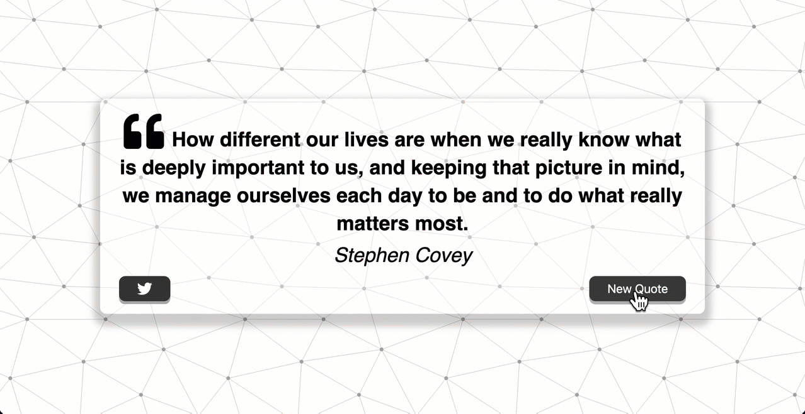

  

<!-- PROJECT LOGO -->

  
  <h3 align="center">Random Quote Generator (JavaScript Project)</h3>

  

  

<!-- ABOUT THE PROJECT -->
## About The Project

In this project I learned how to make an asynchronous fetch request to a REST API inorder to get our quotes but I actually ran into the dreaded CORS error and got a lesson on how to solve that problem incase I encounter it in the future using a proxy API. Taking a look at the example project above we can see that I tried to make it as modern as possible. The first of these elements is adding a Hero Patterns vector background which has many patterns and allows you to make it unique. There is some Font Awesome icons here and am also using a custom Google Font which has many to choose from as well. Down at the bottom we have a New Quote button and you can see that we have a loader which loads in between quotes. The idea is that when this takes time to load, which it does sometimes, we want to signal to the user that something is happening between the scenes even if they cannot see it. The other button we have is a Twitter button which when you click on will open twitter in a new tab and if we are logged in it will allow us to tweet. Lastly, this project is also mobile responsive as well with a little of margin on both sides.

## How It's Made:

**Tech used:** HTML, CSS, JavaScript, Framework of choice

<!-- LICENSE -->
## License

Distributed under the MIT License. See `LICENSE.txt` for more information.

(<a href="#top">back to top</a>)

<!-- CONTACT -->
## Contact

Antony Ekirapa - [@AntonyE84301519](https://twitter.com/AntonyE84301519) - a.m.ekirapa@gmail.com

Project Link: [JS-Random-Quote-Generator-Project](https://mooseki.github.io/JS-Random-Quote-Generator-Project/)

(<a href="#top">back to top</a>)

<!-- ACKNOWLEDGMENTS -->
## Acknowledgments

* [Choose an Open Source License](https://choosealicense.com)
* [GitHub Emoji Cheat Sheet](https://www.webpagefx.com/tools/emoji-cheat-sheet)
* [Malven's Flexbox Cheatsheet](https://flexbox.malven.co/)
* [Malven's Grid Cheatsheet](https://grid.malven.co/)
* [Img Shields](https://shields.io)
* [GitHub Pages](https://pages.github.com)
* [Font Awesome](https://fontawesome.com)
* [React Icons](https://react-icons.github.io/react-icons/search)
* [#100Devs](https://leonnoel.com/100devs/)
* [Zero To Mastery Academy](https://zerotomastery.io/about/instructor/andrei-neagoie/)

(<a href="#top">back to top</a>)

<!-- MARKDOWN LINKS & IMAGES -->
<!-- https://www.markdownguide.org/basic-syntax/#reference-style-links -->
[contributors-shield]: https://img.shields.io/github/contributors/othneildrew/Best-README-Template.svg?style=for-the-badge
[contributors-url]: https://github.com/othneildrew/Best-README-Template/graphs/contributors
[forks-shield]: https://img.shields.io/github/forks/othneildrew/Best-README-Template.svg?style=for-the-badge
[forks-url]: https://github.com/othneildrew/Best-README-Template/network/members
[stars-shield]: https://img.shields.io/github/stars/othneildrew/Best-README-Template.svg?style=for-the-badge
[stars-url]: https://github.com/othneildrew/Best-README-Template/stargazers
[issues-shield]: https://img.shields.io/github/issues/othneildrew/Best-README-Template.svg?style=for-the-badge
[issues-url]: https://github.com/othneildrew/Best-README-Template/issues
[license-shield]: https://img.shields.io/github/license/othneildrew/Best-README-Template.svg?style=for-the-badge
[license-url]: https://github.com/othneildrew/Best-README-Template/blob/master/LICENSE.txt
[linkedin-shield]: https://img.shields.io/badge/-LinkedIn-black.svg?style=for-the-badge&logo=linkedin&colorB=555
[linkedin-url]: linkedin.com/in/antony-e-65258123b
[product-screenshot]: images/screenshot.png
